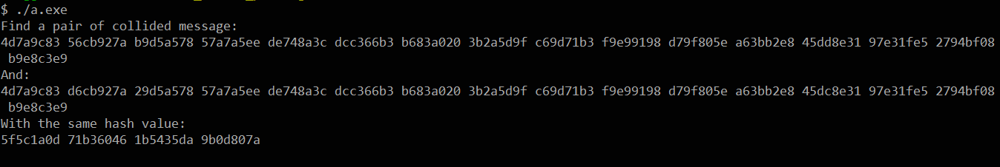

# The Second Preimage attack on MD4 for Some Chosen Message

对MD4哈希函数算法的选择明文第二原像攻击仿真程序的完整代码在文件'Simulation_Program.cpp'中，  

reference:  Xiaoyun Wang, Xuejia Lai, Dengguo Feng, et al. Cryptanalysis of the Hash Functions MD4 and RIPEMD\[C\].//Advances in Cryptoloty-EUROCRYPT 2005.2005:1-18.

程序的运行结果如下图：  


下面使程序的部分代码展示，仿真程序的主函数代码如下，在函数外部开了一个长度为52的全局`unsigned int`类型数组`chain_value`用于保存生成哈希值所需要的连接变量，此外还在函数外部开了一个长度为16的全局的`unsigned int`类型数组`message`用于保存随机生成的消息：  

```C++
int main()
{
    chain_value[0] = 0x67452301;
    chain_value[3] = 0xefcdab89;
    chain_value[2] = 0x98badcfe;
    chain_value[1] = 0x10325476;

    srand((unsigned)time(NULL));
    
    while(true){
        generateMessage();
        mutipleMessageModify();
        
        vector<unsigned int> m1;
        for(int j = 0; j < 16; j++) m1.push_back(message[j]);
        vector<unsigned int> H1 = computeMD4();
        //cout << "Generate the differential message...\n";
        //cout << endl;

        message[1] = message[1] + getTheBit(32);
        message[2] = message[2] + getTheBit(32) - getTheBit(29);
        message[12] = message[12] - getTheBit(17);
        vector<unsigned int> m2;
        for(int j = 0; j < 16; j++) m2.push_back(message[j]);
        vector<unsigned int> H2 = computeMD4();
        
        if(H1 == H2){
            cout << "Find a pair of collided message:\n";
            for(int j = 0; j < 16; j++) printf("%08x ", m1[j]);
            cout << "\nAnd:\n";
            for(int j = 0; j < 16; j++) printf("%08x ", m2[j]);
            cout << "\nWith the same hash value:\n";
            printf("%08x %08x %08x %08x\n", H1[0], H1[1], H1[2], H1[3]);
            break;
        }

    }
    return 0;
}
```

代码的前四行是先对MD4算法的初始链接变量进行初始化。在后面的循环体中，先生成一个随机的消息，再对其进行多消息修改，然后在修改后的消息上添加差分，再分别计算修改后的消息和由差分生成的消息的哈希值，直到发生碰撞，输出被选中的消息及其差分消息，以及它们的哈希值，循环结束。  

随机消息的生成函数的代码如下：  

```C++
void generateMessage(){
    unsigned int a1 = rand();
    unsigned int b0_7 = chain_value[3] & getTheBit(7);
    unsigned int a1_7 = a1 & getTheBit(7);
    a1 = a1 ^ (b0_7 ^ a1_7);
    chain_value[4] = a1;
    message[0] = message_production(4, 3);

    unsigned int d1 = (unsigned int)rand();
    d1 = d1 & (~getTheBit(7));
    unsigned int d1_8 = d1 & getTheBit(8);
    unsigned int a1_8 = chain_value[4] & getTheBit(8);
    unsigned int d1_11 = d1 & getTheBit(11);
    unsigned int a1_11 = chain_value[4] & getTheBit(11);
    d1 = d1 ^ (d1_8 ^ a1_8) ^ (d1_11 ^ a1_11);
    chain_value[5] = d1;
    message[1] = message_production(5, 7);

    unsigned int c1 = (unsigned int)rand();
    c1 = c1 | getTheBit(7);
    c1 = c1 | getTheBit(8);
    c1 = c1 & (~getTheBit(11));
    unsigned int c1_26 = c1 & getTheBit(26);
    unsigned int d1_26 = chain_value[5] & getTheBit(26);
    c1 = c1 ^ (c1_26 ^ d1_26);
    chain_value[6] = c1;
    message[2] = message_production(6, 11);

    unsigned int b1 = (unsigned int)rand();
    b1 = b1 | getTheBit(7);
    b1 = b1 & (~getTheBit(8));
    b1 = b1 & (~getTheBit(11));
    b1 = b1 & (~getTheBit(26));
    chain_value[7] = b1;
    message[3] = message_production(7, 19);

    unsigned int a2 = (unsigned int)rand();
    a2 = a2 | getTheBit(8);
    a2 = a2 | getTheBit(11);
    a2 = a2 & (~getTheBit(26));
    unsigned int a2_14 = a2 & getTheBit(14);
    unsigned int b1_14 = chain_value[7] & getTheBit(14);
    a2 = a2 ^ (a2_14 ^ b1_14);
    chain_value[8] = a2;
    message[4] = message_production(8, 3);

    unsigned int d2 = (unsigned int)rand();
    d2 = d2 | getTheBit(26);
    d2 = d2 & (~getTheBit(14));
    unsigned int d2_19 = d2 & getTheBit(19);
    unsigned int d2_20 = d2 & getTheBit(20);
    unsigned int d2_21 = d2 & getTheBit(21);
    unsigned int d2_22 = d2 & getTheBit(22);
    unsigned int a2_19 = chain_value[8] & getTheBit(19);
    unsigned int a2_20 = chain_value[8] & getTheBit(20);
    unsigned int a2_21 = chain_value[8] & getTheBit(21);
    unsigned int a2_22 = chain_value[8] & getTheBit(22);
    d2 = d2 ^ (d2_19 ^ a2_19) ^ (d2_20 ^ a2_20) ^ (d2_21 ^ a2_21) ^ (d2_22 ^ a2_22);
    chain_value[9] = d2;
    message[5] = message_production(9, 7);

    unsigned int c2 = (unsigned int)rand();
    c2 = c2 | getTheBit(21);
    c2 = c2 & (~getTheBit(14));
    c2 = c2 & (~getTheBit(19));
    c2 = c2 & (~getTheBit(20));
    c2 = c2 & (~getTheBit(22));
    unsigned int c2_13 = c2 & getTheBit(13);
    unsigned int c2_15 = c2 & getTheBit(15);
    unsigned int d2_13 = chain_value[9] & getTheBit(13);
    unsigned int d2_15 = chain_value[9] & getTheBit(15);
    c2 = c2 ^ (c2_13 ^ d2_13) ^ (c2_15 ^ d2_15);
    chain_value[10] = c2;
    message[6] = message_production(10, 11);

    unsigned int b2 = (unsigned int)rand();
    b2 = b2 | getTheBit(13);
    b2 = b2 | getTheBit(14);
    b2 = b2 & (~getTheBit(15));
    b2 = b2 & (~getTheBit(19));
    b2 = b2 & (~getTheBit(20));
    b2 = b2 & (~getTheBit(21));
    b2 = b2 & (~getTheBit(22));
    unsigned int b2_17 = b2 & getTheBit(17);
    unsigned int c2_17 = chain_value[10] & getTheBit(17);
    b2 = b2 ^ (b2_17 ^ c2_17);
    chain_value[11] = b2;
    message[7] = message_production(11, 19);

    unsigned int a3 = (unsigned int)rand();
    a3 = a3 | getTheBit(13);
    a3 = a3 | getTheBit(14);
    a3 = a3 | getTheBit(15);
    a3 = a3 | getTheBit(22);
    a3 = a3 & (~getTheBit(17));
    a3 = a3 & (~getTheBit(19));
    a3 = a3 & (~getTheBit(20));
    a3 = a3 & (~getTheBit(21));
    unsigned int a3_23 = a3 & getTheBit(23);
    unsigned int a3_26 = a3 & getTheBit(26);
    unsigned int b2_23 = chain_value[11] & getTheBit(23);
    unsigned int b2_26 = chain_value[11] & getTheBit(26);
    a3 = a3 ^ (a3_23 ^ b2_23) ^ (a3_26 ^ b2_26);
    chain_value[12] = a3;
    message[8] = message_production(12, 3);

    unsigned int d3 = (unsigned int)rand();
    d3 = d3 | getTheBit(13);
    d3 = d3 | getTheBit(14);
    d3 = d3 | getTheBit(15);
    d3 = d3 | getTheBit(21);
    d3 = d3 | getTheBit(22);
    d3 = d3 | getTheBit(26);
    d3 = d3 & (~getTheBit(17));
    d3 = d3 & (~getTheBit(20));
    d3 = d3 & (~getTheBit(23));
    unsigned int d3_30 = d3 & getTheBit(30);
    unsigned int a3_30 = chain_value[12] & getTheBit(30);
    d3 = d3 ^ (d3_30 ^ a3_30);
    chain_value[13] = d3;
    message[9] = message_production(13, 7);

    unsigned int c3 = (unsigned int)rand();
    c3 = c3 | getTheBit(17);
    c3 = c3 | getTheBit(30);
    c3 = c3 & (~getTheBit(20));
    c3 = c3 & (~getTheBit(21));
    c3 = c3 & (~getTheBit(22));
    c3 = c3 & (~getTheBit(23));
    c3 = c3 & (~getTheBit(26));
    unsigned int c3_32 = c3 & getTheBit(32);
    unsigned int d3_32 = chain_value[13] & getTheBit(32);
    c3 = c3 ^ (c3_32 ^ d3_32);
    chain_value[14] = c3;
    message[10] = message_production(14, 11);

    unsigned int b3 = (unsigned int)rand();
    b3=b3|getTheBit(21);
    b3=b3|getTheBit(22);
    b3=b3|getTheBit(26);
    b3=b3&(~getTheBit(20));
    b3=b3&(~getTheBit(30));
    b3=b3&(~getTheBit(32));
    unsigned int b3_23 = b3 & getTheBit(23);
    unsigned int c3_23 = chain_value[14] & getTheBit(23);
    b3 = b3 ^ (b3_23 ^ c3_23);
    chain_value[15] = b3;
    message[11] = message_production(15, 19);

    unsigned int a4 = (unsigned int)rand();
    a4 = a4 | getTheBit(30);
    a4 = a4 & (~getTheBit(23));
    a4 = a4 & (~getTheBit(26));
    a4 = a4 & (~getTheBit(32));
    unsigned int a4_27 = a4 & getTheBit(27);
    unsigned int a4_29 = a4 & getTheBit(29);
    unsigned int b3_27 = chain_value[15] & getTheBit(27);
    unsigned int b3_29 = chain_value[15] & getTheBit(29);
    a4 = a4 ^ (a4_27 ^ b3_27) ^ (a4_29 ^ b3_29);
    chain_value[16]=a4;
    message[12]=message_production(16, 3);

    unsigned int d4 = (unsigned int)rand();
    d4 = d4 | getTheBit(27);
    d4 = d4 | getTheBit(29);
    d4 = d4 | getTheBit(32);
    d4 = d4 & (~getTheBit(23));
    d4 = d4 & (~getTheBit(26));
    d4 = d4 & (~getTheBit(30));
    chain_value[17]=d4;
    message[13]=message_production(17, 7);

    unsigned int c4 = (unsigned int)rand();
    c4 = c4 | getTheBit(23);
    c4 = c4 | getTheBit(26);
    c4 = c4 & (~getTheBit(27));
    c4 = c4 & (~getTheBit(29));
    c4 = c4 & (~getTheBit(30));
    unsigned int c4_19 = c4 & getTheBit(19);
    unsigned int d4_19 = chain_value[17] & getTheBit(19);
    c4 = c4 ^ (c4_19 ^ d4_19);
    chain_value[18] = c4;
    message[14] = message_production(18, 11);

    unsigned int b4=(unsigned int)rand();
    b4 = b4 | getTheBit(26);
    b4 = b4 | getTheBit(27);
    b4 = b4 | getTheBit(29);
    b4 = b4 & (~getTheBit(19));
    b4 = b4 & (~getTheBit(30));
    chain_value[19] = b4;
    message[15] = message_production(19, 19);
}
```

在生成随机消息的同时对其进行单消息修改，使其满足第一轮中的充分条件。  

随后是多消息修改：  

```C++
void mutipleMessageModify(){
	unsigned int a5 = produce_2(20, message[0], 3);
    unsigned int a5_19 = a5 & getTheBit(19);
    unsigned int c4_19 = chain_value[18] & getTheBit(19);
    if(a5_19 != c4_19)
        correct_for_a5(19);
    unsigned int a5_26 = a5 & getTheBit(26);
    if(a5_26 == 0)
        correct_for_a5(26);
    unsigned int a5_27 = a5 & getTheBit(27);
    if(a5_27 != 0)
        correct_for_a5(27);
    unsigned int a5_29 = a5 & getTheBit(29);
    if(a5_29 == 0)
        correct_for_a5(29);
    unsigned int a5_32 = a5 & getTheBit(32);
    if(a5_32 == 0)
        correct_for_a5(32);

    unsigned int d5 = produce_2(21, message[4], 5);
    unsigned int d5_19 = d5 & getTheBit(19);
    a5_19 = chain_value[20] & getTheBit(19);
    if(d5_19 != a5_19)
        correct_for_d5(19);
    unsigned int d5_26 = d5 & getTheBit(26);
    if(d5_26 == 0)
        correct_for_d5(26);
    unsigned int d5_27 = d5 & getTheBit(27);
    if(d5_27 == 0)
        correct_for_d5(27);
    unsigned int d5_29 = d5 & getTheBit(29);
    if(d5_29 == 0)
        correct_for_d5(29);
    unsigned int d5_32 = d5 & getTheBit(32);
    unsigned int b4_32 = chain_value[19] & getTheBit(32);
    if(d5_32 != b4_32)
        correct_for_d5(32);

    unsigned int c5 = produce_2(22, message[8], 9);
    unsigned int c5_26 = c5 & getTheBit(26);
    d5_26 = chain_value[21] & getTheBit(26);
    if(c5_26 != d5_26)
        correct_for_c5(26);
    unsigned int c5_27 = c5 & getTheBit(27);
    d5_27 = chain_value[21] & getTheBit(27);
    if(c5_27 != d5_27)
        correct_for_c5(27);
    unsigned int c5_29 = c5 & getTheBit(29);
    d5_29 = chain_value[21] & getTheBit(29);
    if(c5_29 != d5_29)
        correct_for_c5(29);
    unsigned int c5_30 = c5 & getTheBit(30);
    unsigned int d5_30 = chain_value[21] & getTheBit(30);
    if(c5_30 != d5_30)
        correct_for_c5(30);
    unsigned int c5_32 = c5 & getTheBit(32);
    d5_32 = chain_value[21] & getTheBit(32);
    if(c5_32 != d5_32)
        correct_for_c5(32);

    unsigned int b5 = produce_2(23, message[12], 13);
    unsigned int b5_29 = b5 & getTheBit(29);
    c5_29 = chain_value[22] & getTheBit(29);
    if(b5_29 != c5_29)
        correct_for_b5(29);
    unsigned int b5_30 = b5 & getTheBit(30);
    if(b5_30 == 0)
        correct_for_b5(30);
    unsigned int b5_32 = b5 & getTheBit(32);
    if(b5_32 != 0)
        correct_for_b5(32);

    unsigned int a6 = produce_2(24, message[1], 3);
    unsigned int a6_29 = a6 & getTheBit(29);
    if(a6_29 == 0)
        correct_for_a6(29);
    unsigned int a6_32 = a6 & getTheBit(32);
    if(a6_32 == 0)
        correct_for_a6(32);

    unsigned int d6 = produce_2(25, message[5], 5);
    unsigned int d6_29 = d6 & getTheBit(29);
    b5_29 = chain_value[24] & getTheBit(29);
    if(d6_29 != b5_29)
        correct_for_d6(29);

    unsigned int c6 = produce_2(26, message[9], 9);
    unsigned int c6_29 = c6 & getTheBit(29);
    d6_29 = chain_value[25] & getTheBit(29);
    if(c6_29 != d6_29)
        correct_for_c6(29);
    unsigned int c6_30 = c6 & getTheBit(30);
    unsigned int d6_30 = chain_value[25] & getTheBit(30);
    if(c6_30 == d6_30)
        correct_for_c6(30);
    unsigned int c6_32 = c6 & getTheBit(32);
    unsigned int d6_32 = chain_value[25] & getTheBit(32);
    if(c6_32 == d6_32)
        correct_for_c6(32);
}
```

先从低位到高位判断是否满足充分条件，如果不满足，就对其进行多消息的修改。  

下面是对$a_5$的多消息修改的函数：  

```C++
void correct_for_a5(int a){
    a = a - 3;
    message[0] = message[0] ^ getTheBit(a);
    chain_value[4] = produce_1(4, message[0], 3);
    message[1] = message_production(5, 7);
    message[2] = message_production(6, 11);
    message[3] = message_production(7, 19);
    message[4] = message_production(8, 3);
    chain_value[20] = produce_2(20, message[0], 3);
}
```

这个函数用于在$a_5$的第 a 个比特不满足充分条件时，对生成$a_5$的消息的 a-3 比特进行取反，然后进行多消息修改，使第一轮中的条件能够得到满足。
